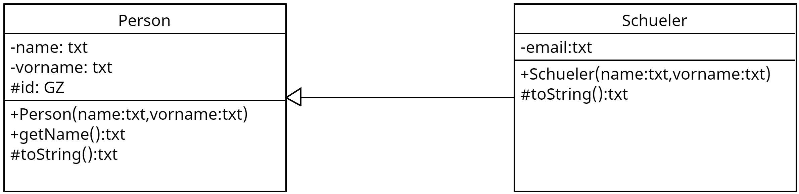

# Beispiel zur Vererbung
## Aufgabe
1. Erstellen Sie die Klassen aus dme UML-Diagramm `KD.uxf`

2. Erstellen SIe die Schueler `Max Meier` und `Detlef Soost` mit der Email Adresse `ds@web.de`
3. Geben Sie alle Daten aller Schueler auf der Konsole aus.
4. Packen Sie alle Schuelerobjekte in eine Liste/Array o.ä.